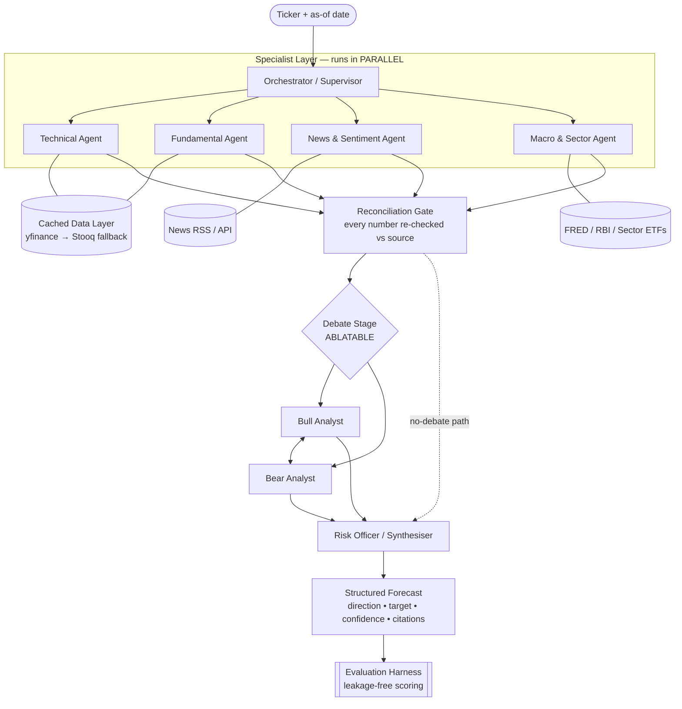

# B.Tech Capstone Project Plan

## Project Title
**Does Adversarial Multi-Agent Debate Improve LLM Financial Forecasting?**
*A leakage-free evaluation of a multi-agent forecasting system on Indian equities*

> Working system name: **Financial Forecasting by Multi-AI Agent System**

---

## 🎯 1. Executive Summary

### The Problem
Financial forecasting requires synthesising several incompatible kinds of evidence at once — technical price signals, fundamental statements, news sentiment, and macroeconomic context. A single LLM handed this task tends to hallucinate quantitative values, cannot fetch live market data on its own, and collapses conflicting signals into bland consensus.

The proposed remedy, borrowed from how real investment firms work, is to **decompose the task across specialist agents** and force an **adversarial Bull vs. Bear debate** before a risk-aware synthesiser issues a final call.

### The Honest Framing (read this before writing the report)
That architecture is **not novel**. It is already published and open-sourced:

> **TradingAgents: Multi-Agents LLM Financial Trading Framework** — arXiv:2412.20138, Tauric Research.
> It contains fundamental / sentiment / technical analyst agents, **Bull and Bear researcher agents that debate**, a **risk management team**, and a trader that synthesises the debate. Code: `github.com/TauricResearch/TradingAgents`.

Claiming "our contribution is the Bull vs. Bear debate layer" would not survive a literature review. A professor who searches the phrase finds this paper immediately.

**So the contribution of this project is deliberately relocated** — from *architecture* to *measurement*:

1. **Most multi-agent finance results are evaluated in a way that leaks the answer.** LLMs have already read what happened to a stock in 2023. Backtesting over the training window measures memory, not forecasting.
2. **Almost nobody measures whether the debate layer actually earns its cost.** It roughly doubles LLM calls and latency. Does accuracy improve, or does it just produce more confident-sounding text?
3. **Indian equities (NSE) are under-studied** in this literature, which is overwhelmingly US-large-cap.

### The Research Question
> **Under an evaluation protocol that provably excludes lookahead bias, does adversarial multi-agent debate produce measurably better stock forecasts than (a) a single-LLM baseline and (b) the same specialist agents without a debate stage — and is any gain worth its token cost?**

This question is worth answering **either way**. A negative, well-measured result ("the debate adds 2.4× cost for no accuracy gain") is a genuine, defensible finding. A project that only demonstrates a working pipeline is not.

---

## 🔬 2. The Two Problems That Sank the Previous Plan

### Problem 1 — Lookahead bias makes naive backtesting invalid
The earlier plan said: *"test forecast accuracy 3 months ago vs actual price movement."*

This does not work. The LLM's weights already encode what happened three months ago. This is a documented, measurable effect:

- **arXiv:2512.23847 — "Detecting Lookahead Bias in LLM Forecasts."** Defines **Lookahead Propensity (LAP)**: the probability the model has internalised a firm-date outcome. LAP is materially positive throughout the training window and **collapses to ~zero immediately after the training cutoff**.
- **arXiv:2605.24564 — "Summoning the Oracle to Slay It."** Mitigation strategies for look-ahead bias in LLM financial backtesting.

**Implication:** the only scientifically safe test window is **after the model's training cutoff**. This constrains the whole project and therefore must be decided in Phase 2, not discovered in Phase 5.

### Problem 2 — The old phase order guaranteed late failure
The previous ordering built the system for ~10 weeks and evaluated it in the final phase. Two consequences:

- If the evaluation turns out to be invalid (it was), there is no time left to fix it.
- The claim "multi-agent beats a single LLM" is impossible unless the single-LLM baseline exists *first*. It was never scheduled.

**The fix in this plan: build the measuring instrument before the thing being measured.** Evaluation moves from Phase 5 to Phase 2. A baseline is produced in Phase 1.

---

## 🤖 3. System Architecture

Two additions to the original design, both taken from verified industry practice:

- **Reconciliation Gate** — every numeric claim an agent makes is re-checked against the source data before it propagates. This is Bloomberg's ASKB pattern; mismatches raise warnings rather than passing silently. It is the single most effective anti-hallucination measure available here.
- **The debate stage is explicitly ablatable** — a `--no-debate` switch routes specialists straight to the synthesiser. Without this switch the central research question cannot be answered.

---

## 👥 4. Agent Breakdown

| # | Agent | Responsibility | Tools / Data | Structured Output |
| :-- | :--- | :--- | :--- | :--- |
| 1 | **Technical** | Price action, momentum, volatility | Cached OHLCV, `pandas-ta-classic` (RSI, MACD, SMA 50/200, Bollinger, ATR) | score −10..+10, trend label, support/resistance, **citations** |
| 2 | **Fundamental** | Valuation & financial health | Statements, ratios (P/E, EV/EBITDA, D/E, ROE) | valuation score, health rating, key metrics |
| 3 | **News & Sentiment** | Catalysts and market mood | News RSS/API, headline NLP | polarity **+ relevance + confidence**, catalyst list, article links |
| 4 | **Macro & Sector** | Rate/inflation regime, sector flows | FRED / RBI data, sector indices | regime label (tailwind/headwind), rationale |
| 5 | **Bull Analyst** | Strongest upside case | Specialist outputs only | growth drivers, upside target |
| 6 | **Bear Analyst** | Strongest downside case | Specialist outputs only | risks, downside target |
| 7 | **Risk Officer / Synthesiser** | Weigh evidence, issue call | Debate + volatility | **direction, target range, confidence %, risk report** |

**Design rules that apply to every agent:**
- Output is a **Pydantic model**, never free text. Unparseable output is a failed run, not a silent pass.
- Every numeric claim carries a **citation** to the exact data point or URL (Samaya AI's anti-hallucination pattern).
- Agents receive an **`as_of` date** and must never see data after it. This is enforced in the data layer, not by prompting.

---

## 📋 5. Implementation Roadmap

Five phases, reordered so that risk is retired early. Week ranges assume a ~13-week semester — compress or stretch proportionally.

Each phase has an **exit gate**: an objective, checkable condition. Do not start the next phase until the gate passes.

---

### Phase 1 — Foundation & Walking Skeleton *(Weeks 1–2)*
**Goal:** one command produces one real forecast, end to end. Thin but complete.

- [ ] Repo scaffold, virtualenv, `requirements.txt` pinned. **Initialise git on day one.**
- [ ] Secure keys: Gemini, news API. (`yfinance` needs no key — that is precisely why it is fragile.)
- [ ] **Build `cache.py` before any other data code.** On-disk cache (SQLite or parquet) keyed by `(ticker, field, as_of)`, in front of *every* external call. Not an optimisation — a prerequisite. Four parallel agents without a cache will trigger Yahoo rate limiting on demo day.
- [ ] `market_data.py` — OHLCV fetch with **automatic Stooq fallback on HTTP 429**, and a hard `as_of` cutoff parameter.
- [ ] `indicators.py` — RSI, MACD, moving averages, ATR, realised volatility.
- [ ] **Ship the single-LLM baseline now:** one Gemini call, given the same data, returns the same Pydantic forecast schema. This is the thing the multi-agent system must beat.
- [ ] One specialist (Technical) implemented end to end as the pattern for the rest.

> **Exit gate:** `python -m forecast RELIANCE.NS --as-of 2026-05-01` returns a valid, schema-conformant forecast from both the baseline and the technical agent, twice in a row, with the second run served from cache and making zero network calls.

---

### Phase 2 — Evaluation Harness & Leakage-Free Protocol *(Weeks 3–4)*
**Goal:** build the ruler before building the thing to be measured. **This is the academic core of the project.**

- [ ] **Establish the model's training cutoff** and fix the test window strictly after it. Do not trust documentation alone — run a **LAP-style recall probe**: ask the model about firm-date outcomes and check whether it "remembers." Record the result; this becomes a figure in the report.
- [ ] **Freeze the evaluation set** — tickers, as-of dates, horizon (e.g. 21 trading days). Write it to a file and commit it. Never modify it again; modifying the test set after seeing results is the definition of overfitting.
- [ ] Implement metrics:
  - **Directional accuracy** (up/down) — the headline number.
  - **MAE / MAPE** on the target price.
  - **Confidence calibration** — when the system says 80%, is it right 80% of the time? (Brier score / reliability curve.) *This is where multi-agent systems most plausibly beat a single LLM, and almost nobody measures it.*
  - **Cost per forecast** — tokens, wall-clock seconds, API calls. Required to answer "is the debate worth it?"
  - A trivial **naive baseline** (e.g. "always predict up", or momentum persistence) to prove the LLM beats a coin flip at all.
- [ ] Harness runs any forecaster over the frozen set and emits a results table (CSV + markdown).
- [ ] **Record baseline results now.** These numbers go in the report regardless of what happens later.

> **Exit gate:** `python -m evaluate --system baseline` produces a complete scored results table over the frozen set, reproducibly, and the LAP probe result is documented.

---

### Phase 3 — Multi-Agent System *(Weeks 5–8)*
**Goal:** the full architecture, built against a harness that already exists.

- [ ] Pydantic schemas for all seven agents.
- [ ] Remaining specialists: Fundamental, News & Sentiment, Macro.
- [ ] **LangGraph `StateGraph`** with supervisor routing and **genuinely parallel** specialist execution (fan-out → fan-in). Add the SQLite checkpointer — a crash mid-run should resume, not restart.
- [ ] **Reconciliation gate** — re-verify every number an agent emits against the cached source; log mismatches.
- [ ] **Bull vs. Bear debate**, bounded to N rounds (start with N=2; unbounded debate burns quota fast).
- [ ] Risk Officer synthesiser → final structured forecast with confidence.
- [ ] **The `--no-debate` ablation switch**, wired from the start.

> **Exit gate:** the full system scores end-to-end on the Phase 2 harness without manual intervention, and reconciliation catches at least one injected fake number in a deliberate test.

---

### Phase 4 — Experiments & Ablation *(Weeks 9–10)*
**Goal:** answer the research question with evidence. **This phase produces the marks.**

- [ ] **Primary comparison:** full multi-agent vs single-LLM baseline vs naive baseline.
- [ ] **Debate ablation:** full system vs `--no-debate`. Report accuracy delta *and* cost delta side by side.
- [ ] **Specialist ablation:** drop each specialist in turn (leave-one-out). Which agents actually contribute? Expect at least one to contribute nothing — that is a finding, not a failure.
- [ ] **Calibration analysis:** reliability curves for each configuration.
- [ ] **Repeat runs** at fixed temperature to report variance. A single run of an LLM system is an anecdote, not a result.
- [ ] **Qualitative failure analysis:** collect 5–10 wrong forecasts and diagnose *why*. Examiners reward this heavily.

> **Exit gate:** every claim intended for the report is backed by a committed results file that can be regenerated by one command.

---

### Phase 5 — Dashboard, Report & Defence *(Weeks 11–13)*
**Goal:** make it demonstrable and defensible. Deliberately last — high demo value, low research value.

- [ ] **FastAPI** backend: `/api/forecast/{ticker}`, streaming agent progress.
- [ ] Dashboard — **Streamlit first**. Only move to React/Next.js if time genuinely remains; a polished React UI earns few extra marks against a missing ablation study.
  - Ticker input, price chart, **live agent execution log**, **Bull vs. Bear debate view**, final forecast card with confidence and citations.
- [ ] Report: literature survey (**TradingAgents cited prominently and positioned against**), architecture diagrams, evaluation protocol, results, failure analysis, limitations.
- [ ] Slides + rehearsed live demo. **Cache a known-good run** — never let a live API call decide whether your defence succeeds.

> **Exit gate:** a clean clone of the repo runs the demo, and the report's every number traces to a committed results file.

---

## 📏 6. Evaluation Protocol (the part that must not be improvised)

| Element | Decision | Why |
| :--- | :--- | :--- |
| **Test window** | Strictly **after** the LLM training cutoff, verified by recall probe | Only way to exclude lookahead bias (arXiv:2512.23847) |
| **Horizon** | Fixed, e.g. 21 trading days | Prevents cherry-picking horizons that flatter results |
| **Universe** | Frozen ticker list, committed to git | Prevents post-hoc test-set edits |
| **Primary metric** | Directional accuracy | Simple, interpretable, hard to game |
| **Secondary** | MAE on target, Brier/calibration, cost per forecast | Calibration and cost are where the debate layer must justify itself |
| **Baselines** | Naive (momentum) + single-LLM + no-debate multi-agent | Without all three, no defensible comparison exists |
| **Repeats** | ≥3 runs per configuration | LLM outputs are stochastic |

**Two honesty rules:**
1. **Never edit the frozen test set after seeing results.** If it must change, report both the old and new results.
2. **News sentiment is the weakest link for historical evaluation** — retrieving the news as it appeared on a past date is genuinely hard, and today's articles about a past date are contaminated. Either restrict sentiment to a live forward-test, or document this limitation explicitly. Do not quietly feed it today's news and call it a backtest.

---

## 🛠️ 7. Technical Stack (verified July 2026)

- **Agent framework:** **LangGraph** (v1.1.x stable; supervisor pattern is the dominant production topology, and JPMorgan's Ask D.A.V.I.D. is built on it). Prefer it over CrewAI for explicit state and checkpointing.
- **LLM:** Gemini API via `gemini-flash-latest`. **Free tier: ~1,500 requests/day, 15 requests/minute, 1M TPM.**
  - Budget implication: a full 7-agent forecast ≈ 7–10 calls → **~150–200 forecasts/day**, and **15 RPM caps you at ~2 forecasts/minute**. Ablation sweeps must be run overnight, not the night before submission. Note the free tier may use prompts for training — avoid anything sensitive.
- **Data:** `yfinance` (primary, **cached, mandatory**) → **Stooq** fallback (no API key, decades of history). `pandas-ta-classic` for indicators (the maintained fork; original `pandas-ta` is at discontinuation risk).
  - ⚠️ `yfinance` is an unofficial scraper. Since Yahoo's Feb-2025 redesign it rate-limits hard (`YFRateLimitError` / HTTP 429). **Alpha Vantage's free tier is now 25 requests/day** — it cannot serve as a backup.
- **Backend:** FastAPI. **Frontend:** Streamlit (primary), React/Next.js only if time allows.
- **Validation:** Pydantic v2 everywhere.

---

## ⚠️ 8. Risk Register

| Risk | Likelihood | Mitigation |
| :--- | :--- | :--- |
| Yahoo rate-limits / breaks | **High** | Cache-first architecture; Stooq fallback; never fetch live during a demo |
| Gemini free-tier quota exhausted mid-experiment | **High** | Cache LLM responses keyed by prompt hash; run sweeps overnight; checkpoint runs |
| Lookahead bias invalidates results | **Certain if ignored** | Phase 2 protocol; post-cutoff window; LAP probe |
| "Not novel — TradingAgents exists" | **Certain if unaddressed** | Cite it explicitly; position as leakage-free evaluation + ablation + NSE focus |
| Historical news is contaminated | **High** | Live forward-test for sentiment, or documented limitation |
| Scope creep into a pretty React UI | **Medium** | Streamlit first; UI is Phase 5 and explicitly thin |
| LLM output unparseable | **Medium** | Pydantic + retry; count parse failures as a reported metric |

---

## 📑 9. Deliverables

1. **Working multi-agent forecasting system** with reconciliation, citations, and a `--no-debate` ablation switch.
2. **Reproducible evaluation harness** + committed frozen test set + results files.
3. **Experimental results:** multi-agent vs single-LLM vs naive; debate ablation; specialist leave-one-out; calibration curves; cost accounting.
4. **Demo dashboard** (Streamlit/FastAPI) with live agent log and debate visualisation.
5. **Thesis report** — literature survey positioning against TradingAgents, architecture, protocol, results, failure analysis, limitations.
6. **Slides + rehearsed demo** with a cached fallback run.

---

## ✅ 10. What Changed From the Previous Plan, and Why

| Change | Reason |
| :--- | :--- |
| Evaluation moved **Phase 5 → Phase 2** | Building the system first meant discovering a broken protocol too late to fix |
| Single-LLM baseline moved into **Phase 1** | The core claim is comparative; the comparison target must exist first |
| Added **leakage-free protocol** | Naive backtesting over the training window measures memory, not forecasting |
| Added **ablation study** | The only way to show the debate layer earns its cost |
| Added **reconciliation gate** and **citations** | Verified industry practice against numeric hallucination |
| Reframed novelty: architecture → **measurement + NSE focus** | The architecture is already published (arXiv:2412.20138) |
| Dashboard demoted to **thin, last** | High effort, low marks relative to the evaluation work |
| Environment setup absorbed into Phase 1 | Not a milestone — an afternoon |

---

### References
- TradingAgents: Multi-Agents LLM Financial Trading Framework — arXiv:2412.20138
- Detecting Lookahead Bias in LLM Forecasts — arXiv:2512.23847
- Summoning the Oracle to Slay It: Mitigating Look-Ahead Bias in Financial Backtesting with LLMs — arXiv:2605.24564
